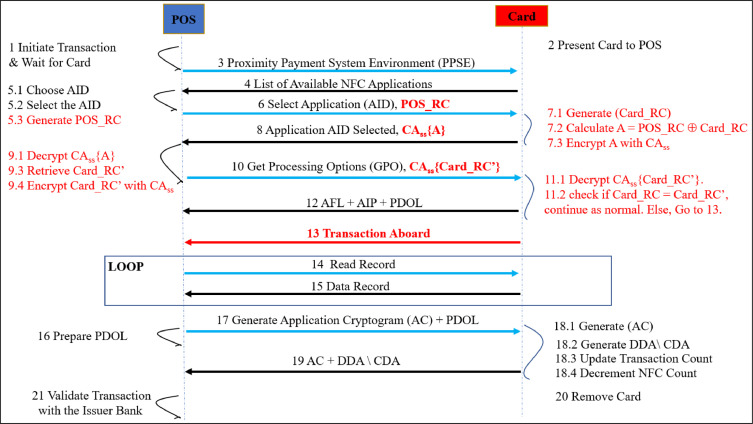

# White Hole
 
WhiteHole: Secure, mnemonic-free wallet with crosschain decentralized chat, smart savings, and easy card payments—powered by Wormhole and Circle.

## Fast Links:

WALLET CODE: [CODE](./WhiteHole/)

PLAYSTORE LINK: [LINK](https://play.google.com/store/apps/details?id=com.altaga.whitehole)

VIDEODEMO: [VIDEO](pending...)

# System Diagram:

## Circle Services:

- Programmable Wallets: Para mejorar la experiencia del usuario y la seguridad en la gestión de sus crypto assets, decidimos implementar las Developer Controlled Wallets, permitiendo a los usuarios manejar sus assets de forma segura y sin el riesgo de perder sus private keys.

  - Main Account: Within the schematics you can see that we have our main wallet, which is a [Developer Controlled Wallet](https://developers.circle.com/w3s/developer-controlled-wallet-quickstart), you won’t have to worry about remembering your mnemonic because Circle protects your wallet. More details in the section [Main Account](#assets-management).

  - Savings Account: This wallet, like the previous one, is a [Developer Controlled Wallet](https://developers.circle.com/w3s/developer-controlled-wallet-quickstart), which will save the savings on each transaction according to the chosen savings protocol. More details in the section [Savings Account](#smart-savings).

  - Card Account: This wallet, like the previous one, is a [Developer Controlled Wallet](https://developers.circle.com/w3s/developer-controlled-wallet-quickstart), sin embargo a diferencia de las anteriores esta solo puede realizatr transacciones cuando es utilizada mediante la tarjeta fisica que se haya usado para crearla. More details in the section [Web3 Card](#recommended-token).

- USDC and EURC: Incorporamos stablecoins como USDC y EURC como opciones recomendables de pago, ya que mantienen una relación 1:1 con activos reales, lo que permite a los negocios y usuarios mandar y recibir crypto assets de forma segura sin arriesgarse a la volatilidad del mercado. More details in the section [Payment Example](#payment-example).

- Smart Contract Platform: En este caso la aplicacion ocupa gestionar informacion de diversos contratos de nuestra creacion, para poder organizar mejor los contratos que tenemos en cada red. More details in the section [SCP](#smart-contract-platform-batch-balances).

- CCTP: Utilizamos el servicio de CCTP que ya tiene integrado Wormhole como Circle Relayer. El cual nos permite de forma muy sencilla realizar Cross Chain Transfers de USDC. More details in the section [CCTP](#cctp-wormhole-integration).

## Wormhole Services:

- Standard Relayer: utilizamos este relayer en nuestro contrato de chat para poder realizar la comunicacion de mensajes entre chains. More details in the section [Standard Relayer](#standard-relayer).

- Circle Relayer: este segundo relayer especializado lo utilizamos debido a la facilidad de poder realizar transferencias crosschain de USDC entre las dinstintas chains que maneja nuestro proyecto. More details in the section [Circle Relayer](#cctp-wormhole-integration).
  
# Features:

Ahora vamos a describir las features principales denuestra aplicacion asi como la implementacion tecnica que tienen estos en relacion a las tecnologias de Circle y Wormhole.

## Main Account:

Como toda wallet en el mercado primero teniamos que cubir las funciones basicas de la misma. La cual en este caso es poder gestionar los crypto assets del usuario, asi como las funciones de recibirlos o mandarlos. En este caso siendo prioritaria la implementacion de USDC y EURC. Ya que estas al ser stablecoins nos proveen de la capacidad de ahorro y adopcion que buscamos solucionar. [1](#references)

  

All technical implementations for main wallet are included here.

- [TAB CODE](./WhiteHole/src/screens/main/tabs/tab1.js)

### Developer Controlled Wallets:

Todos los assets que mantiene esta wallet estan totalmete a disposicion del usuario, sin embargo no las private keys, estas las controlamos mediante la plataforma de Developer Controlled Wallets. Todas las wallets creadas para ser usadas como Main se crean con el prefijo `user_`.

Ademas todas las transacciones que querramos invocar mediante este metodo estan controladas desde nuestra API en [Google Cloud](./Cloud/). Ya que la Main wallet puede realizar transferencias de Native tokens y ERC20 Tokens necesitamos las siguientes 2 funciones para ello.

- Transfer Native Token.

    const transaction = {
        amount: [amount],
        destinationAddress,
        walletId,
        blockchain: blockchains[req.body.chain],
    };
    let response = await circleDeveloperSdk.createTransaction({
        ...transaction,
        fee: {
        type: "level",
        config: {
            feeLevel: "MEDIUM",
        },
        },
    });

- Transfer ERC20 Tokens:

      const interface = new ethers.utils.Interface(abiERC20);
      const transaction = interface.encodeFunctionData("transfer", [
          destinationAddress,
          ethers.utils.parseUnits(amount, token.decimals),
      ]);
      let response = await circleDeveloperSdk.createContractExecutionTransaction({
          walletId,
          callData: transaction,
          contractAddress: token.address,
          fee: {
          type: "level",
          config: {
              feeLevel: "MEDIUM",
          },
          },
      });

All technical implementations for transactions are included here.

- [CLOUD TRANSFER](./Cloud/createTransfer/index.js)

### Smart Contract Platform (Batch Balances):

Parte de la UI/UX de nuetsra wallet depende de poder obtener el balance de multiples tokens al mismo tiempo. Sin embargo realiza la llamada de todos estos contratos al mismo tiempo puede ser tardado, asi que realizamos un contrato que es capaz de realizar una llamada en Batch de todos los ERC20 Tokens que querramos en una sola RPC call. Esto se desplego a cada una de las chains compatibles con la plataforma y el resto mediante Remix.

All technical implementations for this contract are included here.

- [BATCH BALANCES](./Contracts/BatchBalances.sol)

## Smart Savings:

One of the missions of our application is to encourage constant savings, this is normally done through financial education and good consumption habits. However, we go one step further, we make small savings in each purchase and transaction that the user makes.

  

The savings account has a couple of customizable functions.

- Activate Savings: This switch allows you to turn the savings account on and off, so that the user can stop attaching savings transactions to each purchase.

- Savings Period: This drop-down menu allows the user to set a savings goal, whether daily, weekly, monthly or yearly. NOTE: For now it is possible to change it without limitations, but we do not want the user to be able to remove the fixed date of their savings until the deadline is met.

- Savings Protocol: This drop-down menu gives us two options, percentage savings, which will take the percentage that we configure in each purchase or smart savings.

All technical implementations for savings wallet are included here.

- [TAB CODE](./WhiteHole/src/screens/main/tabs/tab2.js)

### Savings Protocol:

- Balanced Protocol, this protocol performs a weighted rounding according to the amount to be paid in the transaction, so that the larger the transaction, the greater the savings, in order not to affect the user. And this is the function code:

        export function balancedSavingToken(number, usd1, usd2) {
            const balance = number * usd1;
            let amount = 0;
            if (balance <= 1) {
                amount = 1;
            } else if (balance > 1 && balance <= 10) {
                amount = Math.ceil(balance);
            } else if (balance > 10 && balance <= 100) {
                const intBalance = parseInt(balance, 10);
                const value = parseInt(Math.round(intBalance).toString().slice(-2), 10);
                let unit = parseInt(Math.round(intBalance).toString().slice(-1), 10);
                let decimal = parseInt(Math.round(intBalance).toString().slice(-2, -1), 10);
                if (unit < 5) {
                unit = '5';
                decimal = decimal.toString();
                } else {
                unit = '0';
                decimal = (decimal + 1).toString();
                }
                amount = intBalance - value + parseInt(decimal + unit, 10);
            } else if (balance > 100) {
                const intBalance = parseInt(Math.floor(balance / 10), 10);
                amount = (intBalance + 1) * 10;
            }
            return new Decimal(amount).sub(new Decimal(balance)).div(usd2).toNumber();
        }

- Percentage protocol, unlike the previous protocol, this one aims to always save a percentage selected in the UI.

        export function percentageSaving(number, percentage) {
            return number * (percentage / 100);
        }

All technical implementations for savings protocols are included here.

- [SAVINGS PROTOCOLS](./WhiteHole/src/utils/utils.js)

### Developer Controlled Wallets:

Todos los assets que mantiene esta wallet estan totalmete a disposicion del usuario, la aplicacion permite cambiar el tiempo de "lock" que tendra los ahorros, hasta que pase este tiempo el usuario no podra disponer de los fondos que se vayan almacenando en esta walet, todas las wallets creadas para ser usadas como Savings se crean con el prefijo `saving_`.

En este caso la transaccion para retirar los fondos una vez se ha terminado el periodo de savings funcionan de la misma forma que explicamos anteriormente. [HERE](#developer-controlled-wallets)

All technical implementations for transactions are included here.

- [CLOUD TRANSFER](./Cloud/createTransfer/index.js)

## Web3 Card:

Part of people's daily adoption of crypto is being able to use it in the same way they use their cell phone or card to make payments, but without neglecting the security and decentralization of crypto. [2](#references)

  

### Contactless Payment:

Payment cards are not just a traditional NFC chip, in fact they are more like small computers with installed programs, which run in milliseconds at the time the chip is being scanned.[3](#references).

So we implemented this card reading to be able to read the sensitive data of the payment cards and with this be able to generate a virtual card that could be used for crypto payments.

All technical implementations for this feature are included here.

- [READ CARD CODE](./WhiteHole/src/screens/main/components/readCard.js)

### Developer Controlled Wallets:

Todos los assets que mantiene esta wallet estan totalmete a disposicion del usuario, sin embargo a diferencia de las wallets anteriores los fondos unicamente son transferidos una vez se realiza el pago con la trajeta fisica ligada a esta cuenta, todas las wallets creadas para ser usadas como Savings se crean con el prefijo `card_`.

En este caso la transaccion para retirar los fondos funciona de la misma forma [HERE](#developer-controlled-wallets), sin embargo esta solo se ejecuta si es leida si es ejecutada con la informacion privada de la tarjeta fisica ligada a la tarjeta. 

#### Payment Example:

El comercio puede ejecutar un pago de forma sencilla abriendo la tab de payment. El pago es igual que realizar el cobro en cualquier POS actual, simplemente poniendo la cantidad en dolares, pasando la tarjeta y ya sea el cliente o el comercio seleccionado el token con el que desea pagar.

NOTA: Colocamos las stablecoins como USDC y EURC como primeras opciones siempre que se realiza un pago ya que el fin de proyecto es que estas se utilicen de forma preferencial.

  

Finalmente una vez seleccionado el token para pagar, podremos ver el estatus en el explorer mainnet, si el hardware lo permite imprimir el recibo para el cliente o regresar al menu principal para realizar otro pago.

  

All technical implementations for transactions are included here.

- [TAB CODE](./WhiteHole/src/screens/paymentWallet/paymentWallet.js)
- [READ CARD CODE](./WhiteHole/src/screens/main/components/readCard.js)
- [CLOUD TRANSFER](./Cloud/createTransfer/index.js)

## MultiChainChat:

La ultima pero no menos importante parte de nuestro proyecto fue el desarrollo de un cross-chain chat el cual permite alos usuarios mandar mensajes de forma completamente decentralizada y con la certidumbre de que la comunicacion entre ellos es completamente encriptada y segura. Ademas de la capacidad de poder realizar transferencias de USDC ya sea sobre la misma chain o crosschain (CCTP). Este feature nos permite incrementar la adopcion y uso de crypto ya que al dia de hoy ya existen alternativas para realizar esto en TradFi como puede ser Venmo o WeChat Pay. [4](#references)

 

Todo el codigo se desarrollo mediante la herramienta de Foundry.

[ENVIRONMENT](./multichain-chat/)

Generamos varios scripts que facilitan al usuario desplegar por si mismo toda la infraestructura del chat, estos scripts permiten calcular el costo, desplegar y configurar absolutamente todo.

- Deploy Estimation: Este script nos da el costo que tendra el despliegue de los contratos en cada una de las chains que configures en el archivo [chains.json](./multichain-chat/deploy-config/chains.json).
  - [CODE](./multichain-chat/script/deployChatEstimation.js)

- Deploy Chat: Este script permite desplegar en cada una de las chains el contrato y a su vez configurarlos de tal forma que puedan intercomunicarse entre si. Este proceso puede ser un poco tardado segun las chains que configures, ya que por cada chain que agregues cada contrato en cada chain tendran que agregarse entre si.
  - [CODE](./multichain-chat/script/deployChat.js)

- Send Message Estimation: Este script nos permite realizar una quote de cual sera el costo de mandar un mensaje de una Chain A a una Chain B. Te recomendamos realizar algunas quotes para asegurarte que los costos son aceptables.
  - [CODE](./multichain-chat/script/sendMessageEstimation.js)

- Send Message: Este script permite mandar un mensaje desde la wallet que tengas configurada como fee payer a otra address que tu decidas agregar, desde una Chain A a una Chain B.
  - [CODE](./multichain-chat/script/sendMessage.js)
  
- Get Messages: Finalmente este script permite recuperar por address todos los mensajes en el chat que se tengan registrados desde o para cierta address en particular.
  - [CODE](./multichain-chat/script/getMessages.js)

### Standard Relayer:

Todos los mensajes que van de una chain a otra utilizan el Standard Relayer para mandar informacion crosschain. Esto esta imlpementado en nuestro MultiChainChat.sol contract en las siguientes funciones.

- Send Crosschain Message: (Origin Chani)

      function sendMessage(
          uint16 targetChain,
          address targetAddress,
          uint256 _GAS_LIMIT,
          // Chat Data
          address to,
          string memory messFrom,
          string memory messTo,
          string memory iv,
          uint256 amount
      ) external payable {
          uint256 cost = quoteCrossChainCost(targetChain, _GAS_LIMIT); // Dynamically calculate the cross-chain cost
          require(
              msg.value >= cost,
              "Insufficient funds for cross-chain delivery"
          );
          wormholeRelayer.sendPayloadToEvm{value: cost}(
              targetChain,
              targetAddress,
              abi.encode(
                  wormholeChainId,
                  targetChain,
                  msg.sender,
                  to,
                  messFrom,
                  messTo,
                  iv,
                  amount,
                  block.timestamp
              ),
              0, // No receiver value needed
              _GAS_LIMIT // Gas limit for the transaction
          );
      }

- Receive Message: (Target Chain)

      function receiveWormholeMessages(
        bytes memory payload,
        bytes[] memory, // additional VAAs (optional, not needed here)
        bytes32 sourceAddress,
        uint16 sourceChain,
        bytes32 // delivery hash
      ) public payable override isRegisteredSender(sourceChain, sourceAddress) {
        require(
            msg.sender == address(wormholeRelayer),
            "Only the Wormhole relayer can call this function"
        );
        // Decode the payload to extract the message
        (
            uint16 fromChainId,
            uint16 toChainId,
            address from,
            address to,
            string memory messFrom,
            string memory messTo,
            string memory iv,
            uint256 amount,
            uint256 blocktime
        ) = abi.decode(
                payload,
                (uint16, uint16, address, address, string, string, string, uint256, uint256)
            );
        // Setup Struct
        Message memory message = Message(
            fromChainId,
            toChainId,
            from,
            to,
            messFrom,
            messTo,
            iv,
            amount,
            blocktime
        );
        // Add Message to Chat
        addMessageWormhole(message);

        // Example use of sourceChain for logging
        if (sourceChain != 0) {
            emit SourceChainLogged(sourceChain);
        }

        // Emit an event with the received message
        emit MessageReceived(message.iv);
      }

All technical implementations for this contract are included here.

- [MultiChainChat](./Contracts/MultiChainChat.sol)

### CCTP Wormhole Integration:

El poder transferir mensajes desde una chain a otra es primordial para el buen funcionamiento de un cross-chain chat, pero a su vez para que esto fuera un producto viable teniamos que tener la capacidad de mandar a su vez USDC ya que queremos seguir el mismo modelo de negocios de empresas como Venmo o WeChat Pay pero en version web3. Asi que para esto fue necesario utilizar el Circle Relayer de Wormhole, el cual es una version de CCTP que Wormhole ya tiene implementada y es muy facil de usar. Sin embargo para poder utilizar este contrato creamos un contrato de interfaz que nos permite utilizar de forma mas sencilla este contrato.

    interface ICircleRelayer {
    event SwapExecuted(
        address indexed recipient,
        address indexed relayer,
        address indexed token,
        uint256 tokenAmount,
        uint256 nativeAmount
    );

    function VERSION() external view returns (string memory);

    function transferTokensWithRelay(
        IERC20Metadata token,
        uint256 amount,
        uint256 toNativeTokenAmount,
        uint16 targetChain,
        bytes32 targetRecipientWallet
    ) external payable returns (uint64 messageSequence);

    function bytes32ToAddress(bytes32 address_) external pure returns (address);
    }

All technical implementations for this interface are included here.

- [Circle Relayer Interface](./Contracts/ICircleRelayer.sol)

### Smart Contract Platform (Chat Contracts):

Los contratos deplegados con el Enviroment de Foundry los agrupamos en nuestra plataforma de Circle con el fin de tener un mejor control y visualizacion de los contratos necesarios para el proyecto

### Developer Controlled Wallets:

A diferencia de solo transferir assets, el interactuar con los smart contracts de MultiChainChat y Circle Relayer requirieron algunas consideraciones adicionales a la hora de usar las Developer Controlled Wallets. Vamos a explicar las funciones mas importantes utilizadas para que esto pudiera realizarse correctamente, sin embargo todo el codigo estara disponible al final de esta seccion.

- Send Message Cross-chain with Programmable Wallets: Este tipo de transaccion puede ser realizada en solo uns transaccion. Esta es ejecutada mediante el Javascript SDK de circle.

      const data = chatInterface.encodeFunctionData('sendMessage', [
        this.context.value.toChain,
        chains[index2].crossChainChat,
        gas_limit,
        to,
        messFrom,
        messTo,
        iv,
        ethers.utils.parseUnits(
          this.state.amount === '' ? '0' : this.state.amount,
          6,
        ),
      ]);
      let response = await circleDeveloperSdk.createContractExecutionTransaction({
          walletId,
          amount: myamount,
          callData: data,
          contractAddress: chatSelector[fromChain],
          fee: {
              type: "level",
              config: {
                  feeLevel: "MEDIUM",
              },
          },
      });

- Send CCTP transfer: Aunado al mensaje cross-chain que es mandado en el chat, el realizar una transferencia desde el Circle Relayer involucra 2 pasos, el cual es realizar un approve de la cantidad que se va a transferir desde la Developer Programmable Wallet y posteriormente ejecutar la transaccion para realizar el transfer con el relayer.

      let interface = new ethers.utils.Interface(abiERC20);
      let transaction = interface.encodeFunctionData("approve", [
          circleRelayerAddress,
          amount
      ]);
      let response = await circleDeveloperSdk.createContractExecutionTransaction({
          walletId,
          callData: transaction,
          contractAddress: usdcSelector[fromChain],
          fee: {
              type: "level",
              config: {
                  feeLevel: "MEDIUM",
              },
          },
      });
      const { id: myId } = response.data;
      await new Promise((resolve) => {
          const interval = setInterval(async () => {
              response = await circleDeveloperSdk.getTransaction({
                  id:myId,
              });
              if (response.data.transaction.state === "CONFIRMED") {
                  clearInterval(interval);
                  resolve(response.data.transaction.txHash);
              }
          }, 1000);
      });
      interface = new ethers.utils.Interface(abiCircleRelayer);
      transaction = interface.encodeFunctionData("transferTokensWithRelay", [
          usdcSelector[fromChain],
          amount,
          0,
          toChain,
          addressToBytes32(to)
      ]);
      response = await circleDeveloperSdk.createContractExecutionTransaction({
          walletId,
          callData: transaction,
          contractAddress: circleRelayerAddress,
          fee: {
              type: "level",
              config: {
                  feeLevel: "MEDIUM",
              },
          },
      });

All technical implementations for this interface are included here.

- [Circle Relayer Interface](./Contracts/ICircleRelayer.sol)

### UI/UX:

Aunque este proceso puede parecer algo complicado, cara al usuario es tan sencillo como elegir la chain origen, la chain objectivo, la cantidad a mandar y presionar el boton de mandar. Toda esta abtraccion es gracias a Wormhole y Circle.

  

# References:

1. https://cointelegraph.com/news/stablecoin-issuer-circle-partners-sony-blockchain-lab-usdc-expansion
2. https://www.triple-a.io/cryptocurrency-ownership-data
3. https://medium.com/@androidcrypto/talk-to-your-credit-card-android-nfc-java-d782ff19fc4a
4. https://stripe.com/en-mx/resources/more/text-to-pay-101-what-it-is-how-it-works-and-how-to-implement-it

